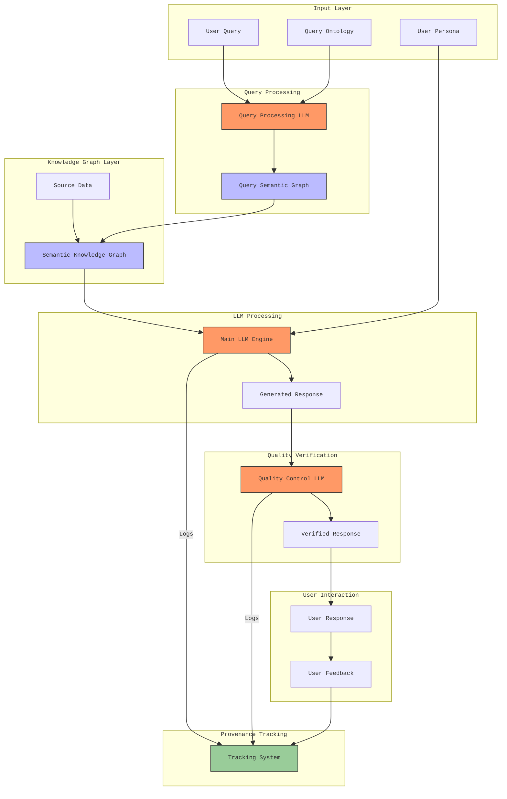

# The Cyber Boardroom: "LLMs as a Commodity" Strategy

## Executive Summary

The Cyber Boardroom's approach to Large Language Models (LLMs) is grounded in Wardley Mapping principles, specifically the natural evolution of components through the Innovate-Leverage-Commoditize (ILC) cycle. Rather than competing in the rapidly commoditizing space of model development, the platform positions itself to leverage LLMs as they evolve from product to commodity, focusing on value creation through novel applications and integrations.

This strategy aligns with Simon Wardley's observation that components naturally evolve from genesis to custom-built to product to commodity. By treating LLMs as evolving commodities, the platform can focus on higher-order value creation while benefiting from the continuing industrialization and standardization of language models.

The platform creates sustainable advantages through a provider-agnostic architecture, sophisticated prompt engineering with graph-based knowledge representation, and advanced multi-model orchestration. This approach recognizes that while individual models are rapidly commoditizing, the intelligence about their optimal use, orchestration, and integration represents a significant value creation opportunity.

## Strategic Positioning Through Wardley Mapping

To illustrate The Cyber Boardroom's strategic approach to LLMs, let's examine two contrasting Wardley Maps that demonstrate different positions in the value chain:

### The Cyber Boardroom - LLMs as Commodity Strategy 


This map reveals The Cyber Boardroom's strategic positioning, where value creation happens primarily through Multi-Model Orchestration and sophisticated Prompt Engineering, treating LLMs themselves as commodity components. Key strategic elements include:

- Positioning core Business Value at the top of the chain
- Using Multi-Model Orchestration as a key differentiator
- Leveraging Prompt Engineering as a strategic capability
- Implementing Model Selection rather than model development
- Treating LLM APIs and Base Models as commodities

This approach creates sustainable competitive advantage by building value above the commodity layer, focusing on orchestration and integration rather than model development.

### Traditional AI Startup - Custom Model Approach


In contrast, this map shows the typical approach taken by AI startups that focus on developing custom models. This strategy involves:

- Creating Business Value through Custom AI Solutions
- Heavy investment in Model Fine-tuning
- Dependence on specialiaed Training Data
- Complex Model Architecture development

This approach carries higher risk as it competes directly in areas that are rapidly commoditizing, requiring significant ongoing investment in model development and maintenance.

The contrast between these approaches highlights The Cyber Boardroom's strategic advantage: by treating LLMs as commodities and focusing on higher-order value creation through orchestration and integration, the platform positions itself to benefit from, rather than compete with, the continuing evolution and commoditization of language models

## Core Strategy Components

### 1. Provider Integration Framework

The platform's integration framework treats LLMs as interchangeable components, aligning with Wardley's principle of leveraging commodity components while creating value at higher levels of abstraction. This approach enables seamless integration with major LLM providers while supporting self-hosted and air-gapped deployments.

The architecture anticipates continuing market evolution by maintaining strict provider independence through standardized interfaces. This allows the platform to leverage provider competition and benefit from continuing cost reductions in inference, positioning it to take advantage of the natural evolution toward commoditization that Wardley Mapping predicts for maturing technologies.

For air-gapped installations, the platform provides complete functionality through locally hosted models, ensuring that sensitive environments can benefit from LLM capabilities without compromising security. The framework's dynamic provider selection capabilities automatically optimize model choice based on real-time analysis of performance, cost, and reliability metrics.

### 2. Prompt Engineering Architecture

The platform's prompt engineering architecture implements a sophisticated multi-layer system for processing queries and generating responses, with dedicated components for knowledge management, quality control, and user interaction tracking.

**Input Processing**  
The input layer handles three key elements: the user's query, query ontology for semantic understanding, and user persona information. These components work together to ensure accurate query interpretation and appropriate response contextualization. The Query Processing LLM transforms raw queries into semantic graphs, enabling integration with the platform's knowledge base.

**Knowledge Integration**  
The Knowledge Graph Layer serves as the system's core intelligence component, combining source data with query-specific semantic graphs. This creates a rich context for response generation while maintaining clear provenance of information. The semantic graph structure enables efficient information retrieval and ensures that responses are grounded in verified source material.

**Response Generation**  
The Main LLM Engine generates responses by combining the semantic knowledge graph with user persona information. This ensures that responses are not only accurate but also appropriately tailored to the user's context and needs. The system maintains strict tracking of all LLM interactions, enabling complete provenance of generated content.

**Quality Assurance**  
A dedicated Quality Control LLM verifies generated responses before delivery to users. This additional layer ensures response quality, accuracy, and appropriateness. The verification process considers both the technical accuracy and the contextual appropriateness of responses, creating a robust quality control system.

**User Interaction and Feedback**  
The system captures and processes user responses and feedback, feeding this information back into the provenance tracking system. This creates a continuous improvement loop that enhances response quality and system understanding over time. The tracking system maintains comprehensive logs of all system interactions, from initial query processing through response generation and user feedback.

### 3. Advanced Graph Processing Architecture

As LLMs evolve toward commodity status following Wardley's evolution patterns, the platform creates differentiated value through its sophisticated approach to knowledge graph processing and integration. This capability becomes increasingly important as basic LLM capabilities standardize, representing a higher-order component in the value chain.

The platform's graph processing system implements model-specific optimizations that adapt knowledge representation based on each LLM's characteristics. This includes advanced compression techniques that maintain semantic meaning while reducing token consumption, and specialized formatting that enhances model comprehension. These optimizations become increasingly valuable as model costs commoditize, allowing for more sophisticated multi-model interactions.

Integration patterns form another key element of the architecture, defining how knowledge graphs interact with different LLM providers. The system implements sophisticated graph injection strategies that maintain consistency across models while enabling provider-specific optimizations. This approach aligns with Wardley's principle of building value above commodity components, creating unique capabilities that leverage but don't depend on specific LLM implementations.

### 4. Parallel Model Operations

The platform's parallel model operations represent a strategic response to LLM commoditization, following Wardley's principle of creating value through novel combinations of commodity components. This approach treats individual LLM calls as reliable but potentially fallible components, implementing sophisticated verification and reconciliation systems to enhance overall system reliability.

The execution strategy employs multiple models in parallel for critical operations, implementing triple redundancy checks and cross-model validation to ensure result consistency. This approach becomes increasingly viable as model costs decrease through commoditization, enabling more sophisticated verification patterns that would be cost-prohibitive with premium-priced models.

Cost management within parallel operations reflects the evolving LLM marketplace, dynamically selecting providers based on real-time price-performance metrics. The system maintains optimal cost efficiency through intelligent workload distribution and resource pooling, aligning with Wardley's patterns of commodity component management.

### 5. Cost Evolution Strategy

The platform's cost strategy directly leverages Wardley's predictions about component evolution, particularly the tendency for successful components to move from custom-built to product to commodity, with corresponding cost reductions. This strategic approach anticipates and capitalizes on the continuing commoditization of LLM capabilities, particularly as players like Grok and OpenSamba drive inference costs down.

The platform implements dynamic cost pass-through mechanisms that maintain consistent markup rates while sharing provider cost reductions with customers. This approach aligns with Wardley's concepts of value chain management, where commoditizing components enable new value creation opportunities at higher levels. As basic inference costs decrease, the platform can implement more sophisticated multi-model strategies and verification systems that were previously cost-prohibitive.

Rather than attempting to compete on basic model capabilities, the platform focuses investment on higher-order value creation through sophisticated orchestration and optimization. This strategy recognizes that as LLMs commoditize, competitive advantage shifts to novel applications and integrations rather than basic model capabilities.

### 6. Advanced Caching Architecture

The caching architecture represents a strategic response to LLM commoditization patterns identified in Wardley Mapping, creating value through intelligent optimization of commodity components. As model interactions become cheaper and more standardized, sophisticated caching strategies become increasingly important for maintaining competitive advantage.

The system implements context-aware caching that considers not just query patterns but also the evolution of knowledge and context over time. This approach enables efficient resource utilization while maintaining response quality, becoming increasingly valuable as organizations scale their LLM usage. Cache invalidation strategies balance freshness requirements against computational efficiency, implementing sophisticated update triggers that maintain result validity while minimizing unnecessary recomputation.

Performance optimization extends beyond basic response caching to include pattern recognition and preemptive computation. The system learns from usage patterns to predict likely queries, preparing responses in advance when computational resources are available at lower costs. This capability becomes increasingly valuable as organizations expand their LLM usage, enabling efficient scaling while maintaining response quality.

### 7. Semantic Knowledge Integration

While LLMs increasingly commoditize according to Wardley's evolution patterns, the platform creates distinctive value through sophisticated knowledge integration capabilities. This aligns with Wardley's principle that as components commoditize, competitive advantage shifts to novel applications and combinations of these components.

The platform implements a sophisticated graph-based knowledge representation system that optimizes information for LLM consumption. This includes specialized compression techniques that maintain semantic meaning while reducing token usage, enabling more efficient model interactions. The system's ability to transform and optimize knowledge representations becomes increasingly valuable as basic LLM capabilities standardize, representing a higher-order component in the value chain.

More importantly, the platform maintains strong provenance tracking for all information sources and LLM interactions. This capability becomes critical as organizations scale their LLM usage, enabling clear traceability and accountability for all generated content. The system tracks not just the source of information but also the specific models, prompts, and contexts used in generating responses, creating an auditable trail of decision-making.

## Technical Implementation

### Provider Integration Framework

The platform's technical implementation reflects Wardley's principles of component evolution, particularly in its approach to provider integration. The system implements a sophisticated abstraction layer that treats individual LLM providers as interchangeable components where appropriate, while still enabling provider-specific optimizations when beneficial.

API abstraction maintains strict provider independence through standardized interfaces, enabling rapid integration of new providers while protecting against vendor lock-in. This approach allows the platform to leverage provider competition while maintaining consistent functionality across different deployment scenarios. Version management handles the complexity of evolving provider capabilities, ensuring smooth transitions as providers update their models and APIs.

### Quality Assurance System

The quality assurance system implements multi-layer verification that becomes increasingly sophisticated as basic model capabilities commoditize. This includes advanced result verification through multi-model consensus, automated quality scoring, and comprehensive performance monitoring.

The monitoring system tracks real-time performance metrics across all integrated providers, enabling dynamic optimization of model selection and resource allocation. This includes sophisticated cost analysis that considers not just basic inference costs but also the value generated through different model combinations and verification strategies.

## Strategic Advantages

The platform's strategy creates sustainable competitive advantages through multiple mechanisms, all aligned with Wardley's principles of component evolution and value creation:

Provider independence enables the platform to leverage market competition while maintaining consistent functionality. This becomes increasingly valuable as the LLM market matures and standardizes, enabling rapid adoption of improved capabilities while avoiding vendor lock-in.

The focus on creating value above the commodity layer ensures sustainable differentiation even as basic model capabilities standardize. This includes sophisticated orchestration, optimization, and knowledge integration capabilities that become more valuable as organizations scale their LLM usage.

## Development Discipline Framework

The platform's development approach implements strict discipline in feature creation and evolution, aligned with Wardley's principles of component evolution and value creation. This framework ensures that development efforts remain focused on creating genuine value while avoiding common pitfalls that often derail AI startups.

### Hypothesis-Driven Development

Every development initiative begins with a clearly articulated hypothesis about the value it will create, following Wardley's emphasis on strategic positioning and evolution. These hypotheses must be specific enough for testing and measurement, focusing on quantifiable metrics such as billable feature creation, user engagement improvements, or enhanced platform capabilities.

The development process implements continuous hypothesis testing through multiple MVPs (Minimum Viable Prototypes), creating a feedback loop that influences development direction. This approach enables early course correction when hypotheses prove incorrect, minimizing resource waste while maintaining strategic alignment.

## Risk Management

### Technical Risk Mitigation

The platform's risk management strategy aligns with Wardley's principles of component evolution and risk assessment. Provider risk management implements multiple integrations and backup systems, enabling dynamic routing of requests based on provider availability and performance. Quality risk management employs sophisticated verification systems and performance monitoring, ensuring consistent output quality across different providers and deployment scenarios.

### Strategic Risk Management

Long-term risk management focuses on market evolution and value protection, following Wardley's patterns of component evolution. The platform maintains active technology tracking and provider monitoring, enabling rapid adaptation to market changes while protecting created value through continuous innovation and quality maintenance.

## Future-Proofing Through Evolution

The platform's future-proofing strategy builds directly on Wardley's principle that evolution is predictable, particularly in technology markets. This approach anticipates and prepares for continuing market evolution while maintaining focus on sustainable value creation.

### Current Trajectory

Market analysis indicates increasing standardization of LLM capabilities, continuing cost reduction in basic inference, and growing provider competition. These trends align with Wardley's predictions about component evolution, particularly the movement from product to commodity status.

### Strategic Response

The platform's architecture anticipates these changes through provider-agnostic design and focus on value creation above the commodity layer. This includes adaptation to emerging standards while maintaining focus on unique applications and capabilities that become more valuable as basic model capabilities commoditize.

## Conclusion

The Cyber Boardroom's LLM strategy represents a sophisticated application of Wardley Mapping principles to the rapidly evolving AI landscape. By treating LLMs as evolving commodities while creating value through higher-order capabilities, the platform maintains sustainable competitive advantages while benefiting from continuing market evolution.

The strategy's emphasis on provider independence, sophisticated optimization, and strong provenance tracking creates unique capabilities that become more valuable as basic model capabilities standardize. Through disciplined development, comprehensive risk management, and evolution-aware architecture, the platform delivers consistent value while adapting to market changes, positioning it for long-term success in the enterprise AI market.

# Diagrams

####  Prompt Engineering Architecture



### Wardley maps

#### The Cyber Boardroom - LLMs as Commodity Strategy 


```wardleymap

component Business Value [0.95, 0.45]
component Multi-Model Orchestration [0.74, 0.47] label [17.28, -18.94]
component Prompt Engineering [0.54, 0.32] label [-27.39, 8.99]
component Model Selection [0.45, 0.59] label [10.58, -18.94]
component LLM APIs [0.25, 0.72]
component Base Models [0.15, 0.82] label [11.70, 0.05]

Business Value->Cyber Translation
Multi-Model Orchestration->Model Selection
Model Selection->LLM APIs
LLM APIs->Base Models
Prompt Engineering->Multi-Model Orchestration

evolution Genesis->Custom-built->Product->Commodity

size [740,400] 
Business Value->Multi-Model Orchestration
```

#### Traditional AI Startup - Custom Model Approach

```wardleymap

component Business Value [0.95, 0.45]
component Custom AI Solution [0.79, 0.26] label [-53.08, -23.40]
component Prompt Engineering [0.59, 0.28] label [-27.39, 8.99]
component Model Fine-tuning [0.55, 0.41] label [11.70, -10.00]
component Training Data [0.39, 0.25] label [-32.98, 26.86]
component Model Architecture [0.31, 0.46] label [-56.43, 2.29]
component Base Models [0.15, 0.82]

Business Value->Custom AI Solution
Custom AI Solution->Model Fine-tuning
Model Fine-tuning->Training Data
Model Fine-tuning->Model Architecture
Model Architecture->Base Models

evolution Genesis->Custom-built->Product->Commodity

size [750,400]
Prompt Engineering->Custom AI Solution
```

