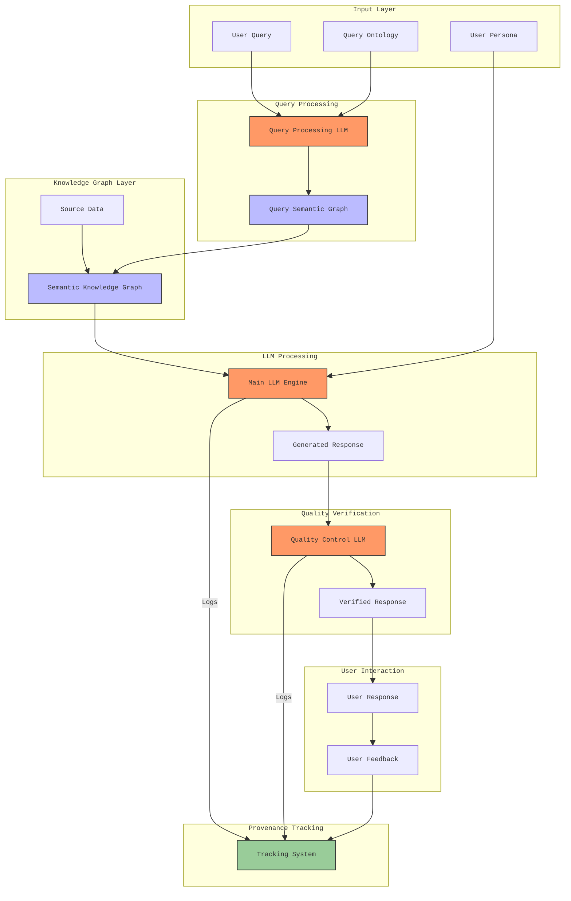

# The Cyber Boardroom: "LLMs as a Commodity" Strategy

## Executive Summary

The Cyber Boardroom's approach to Large Language Models (LLMs) is grounded in Wardley Mapping principles, specifically the natural evolution of components through the Innovate-Leverage-Commoditize (ILC) cycle. Rather than competing in the rapidly commoditizing space of model development, the platform positions itself to leverage LLMs as they evolve from product to commodity, focusing on value creation through novel applications and integrations.

This strategy aligns with Simon Wardley's observation that components naturally evolve from genesis to custom-built to product to commodity. By treating LLMs as evolving commodities, the platform can focus on higher-order value creation while benefiting from the continuing industrialization and standardization of language models.

The platform creates sustainable advantages through a provider-agnostic architecture, sophisticated prompt engineering with graph-based knowledge representation, and advanced multi-model orchestration. This approach recognizes that while individual models are rapidly commoditizing, the intelligence about their optimal use, orchestration, and integration represents a significant value creation opportunity.

## Strategic Positioning Through Wardley Mapping

To illustrate The Cyber Boardroom's strategic approach to LLMs, let's examine two contrasting Wardley Maps that demonstrate different positions in the value chain:

### The Cyber Boardroom - LLMs as Commodity Strategy 


This map reveals The Cyber Boardroom's strategic positioning, where value creation happens primarily through Multi-Model Orchestration and sophisticated Prompt Engineering, treating LLMs themselves as commodity components. Key strategic elements include:

- Positioning core Business Value at the top of the chain
- Using Multi-Model Orchestration as a key differentiator
- Leveraging Prompt Engineering as a strategic capability
- Implementing Model Selection rather than model development
- Treating LLM APIs and Base Models as commodities

This approach creates sustainable competitive advantage by building value above the commodity layer, focusing on orchestration and integration rather than model development.

### Traditional AI Startup - Custom Model Approach


In contrast, this map shows the typical approach taken by AI startups that focus on developing custom models. This strategy involves:

- Creating Business Value through Custom AI Solutions
- Heavy investment in Model Fine-tuning
- Dependence on specialiaed Training Data
- Complex Model Architecture development

This approach carries higher risk as it competes directly in areas that are rapidly commoditizing, requiring significant ongoing investment in model development and maintenance.

The contrast between these approaches highlights The Cyber Boardroom's strategic advantage: by treating LLMs as commodities and focusing on higher-order value creation through orchestration and integration, the platform positions itself to benefit from, rather than compete with, the continuing evolution and commoditization of language models

## Core Strategy Components

### 1. Provider Integration Framework

The platform's integration framework treats LLMs as interchangeable components, aligning with Wardley's principle of leveraging commodity components while creating value at higher levels of abstraction. This approach enables seamless integration with major LLM providers (including OpenAI, Anthropic, Google, and open-source models) while also supporting self-hosted and air-gapped deployments through a unified API interface that handles request/response protocols, token management, error handling, and streaming responses.

The architecture anticipates continuing market evolution by maintaining strict provider independence through standardized interfaces. This allows the platform to leverage provider competition and benefit from continuing cost reductions in inference, positioning it to take advantage of the natural evolution toward commoditization that Wardley Mapping predicts for maturing technologies. The framework's dynamic provider selection capabilities automatically optimize model choice based on real-time analysis of performance metrics, cost efficiency, reliability, and response quality.

For air-gapped installations, the platform provides complete functionality through locally hosted models, ensuring that sensitive environments can benefit from LLM capabilities without compromising security. The framework supports various deployment patterns including fully air-gapped local hosting, hybrid deployments with selective provider access, multi-region deployments with geographic routing, and high-availability configurations with provider failover.

### 2. Prompt Engineering Architecture

The platform's prompt engineering architecture implements a sophisticated multi-layer system for processing queries and generating responses, with dedicated components for knowledge management, quality control, and user interaction tracking.

**Input Processing**  
The input layer handles three key elements: the user's query, query ontology for semantic understanding, and user persona information. These components work together to ensure accurate query interpretation and appropriate response contextualization. The Query Processing LLM transforms raw queries into semantic graphs, enabling integration with the platform's knowledge base.

**Knowledge Integration**  
The Knowledge Graph Layer serves as the system's core intelligence component, combining source data with query-specific semantic graphs. This creates a rich context for response generation while maintaining clear provenance of information. The semantic graph structure enables efficient information retrieval and ensures that responses are grounded in verified source material.

**Response Generation**  
The Main LLM Engine generates responses by combining the semantic knowledge graph with user persona information. This ensures that responses are not only accurate but also appropriately tailored to the user's context and needs. The system maintains strict tracking of all LLM interactions, enabling complete provenance of generated content.

**Quality Assurance**  
A dedicated Quality Control LLM verifies generated responses before delivery to users. This additional layer ensures response quality, accuracy, and appropriateness. The verification process considers both the technical accuracy and the contextual appropriateness of responses, creating a robust quality control system.

**User Interaction and Feedback**  
The system captures and processes user responses and feedback, feeding this information back into the provenance tracking system. This creates a continuous improvement loop that enhances response quality and system understanding over time. The tracking system maintains comprehensive logs of all system interactions, from initial query processing through response generation and user feedback.

### 3. Advanced Graph Processing Architecture

As LLMs evolve toward commodity status following Wardley's evolution patterns, the platform creates differentiated value through its sophisticated approach to knowledge graph processing and integration. The platform's Knowledge Graph Layer serves as the core intelligence component, combining source data with query-specific semantic graphs to create rich contextual understanding that becomes increasingly valuable as basic LLM capabilities standardize, representing a higher-order component in the value chain.

The platform's graph processing system implements model-specific optimizations that adapt knowledge representation based on each LLM's characteristics, transforming raw queries into semantic graphs that enable efficient information retrieval and verified source material integration. This semantic graph structure maintains clear provenance of information while enabling sophisticated multi-model interactions, becoming increasingly valuable as model costs commoditize and allowing the platform to leverage multiple specialized models without compromising accuracy or increasing costs.

The system implements sophisticated graph injection strategies that maintain consistency between the Knowledge Graph Layer and different LLM providers, creating a flexible and extensible architecture for knowledge integration. This approach aligns with Wardley's principle of building value above commodity components, ensuring that all LLM interactions are grounded in verified source material while enabling provider-specific optimizations that enhance response quality and maintain semantic accuracy across the entire system.

### 4. Parallel Model Operations

The platform's parallel model operations represent a strategic response to LLM commoditization, following Wardley's principle of creating value through novel combinations of commodity components. This approach integrates with the Quality Control LLM system to implement sophisticated verification and reconciliation processes, treating individual LLM calls as reliable but potentially fallible components that require cross-validation to ensure response accuracy and consistency across the platform's knowledge graph architecture.

The execution strategy employs multiple models in parallel for critical operations, implementing triple redundancy checks and cross-model validation that work in conjunction with the Knowledge Graph Layer to ensure result consistency and source material verification. This multi-model approach becomes increasingly viable as model costs decrease through commoditization, enabling sophisticated verification patterns that combine specialized models for different aspects of response generation and validation while maintaining provenance tracking throughout the process.

Cost management within parallel operations reflects the evolving LLM marketplace, dynamically selecting providers based on real-time price-performance metrics while maintaining the platform's strict provider independence. The system achieves optimal cost efficiency through intelligent workload distribution and resource pooling across providers, aligning with Wardley's patterns of commodity component management while ensuring that parallel operations enhance rather than compromise the platform's core capabilities in knowledge management and response quality.

### 5. Cost Evolution Strategy

The platform's cost strategy directly leverages Wardley's predictions about component evolution in the LLM space, particularly focusing on the emerging price competition from new market entrants and open-source alternatives. This strategic approach anticipates the accelerating commoditization of LLM capabilities, positioning the platform to take advantage of market dynamics while maintaining value through its higher-order capabilities.

The platform implements a transparent cost pass-through architecture with consistent markup rates, automatically sharing provider cost reductions with customers as the market evolves. This approach builds long-term customer trust and aligns with Wardley's concepts of value chain management, where the platform's competitive advantage comes not from markup on commodity services, but from the value created through sophisticated orchestration and integration capabilities.

The cost management system integrates directly with the platform's provider selection and workload distribution mechanisms to optimize spending across different usage patterns and customer requirements. By treating cost as a first-class architectural concern, the platform can make intelligent trade-offs between performance, reliability, and cost at every level of operation, while ensuring that cost savings from provider competition and technological advancement directly benefit the end users.

### 6. Advanced Caching Architecture

The caching architecture represents a strategic response to LLM commoditization patterns identified in Wardley Mapping, creating value through intelligent optimization at multiple layers of the prompt engineering pipeline. The system implements distinct caching strategies for each component: query ontology matching at the Input Processing layer, semantic graph caching in the Knowledge Graph Layer, and response caching at the Main LLM Engine layer. This multi-layered approach, powered by the Serverless Mgraph-AI package, enables fine-grained cache control and optimization at each processing stage.

The system's context-aware caching extends across the entire prompt engineering pipeline, with specialized caching strategies for each component. At the input layer, it caches query ontology mappings and persona-specific query transformations. The Knowledge Graph Layer caches both the constructed semantic graphs and their intermediate processing states, while the Quality Control LLM layer maintains a cache of verification patterns and common validation results. This comprehensive approach optimizes resource utilization by reducing redundant computations at each stage of processing.

The platform's predictive caching capabilities leverage the semantic understanding from the Knowledge Graph Layer to identify and preemptively cache related information clusters. When a query is processed, the system not only caches the direct response but also precomputes and caches likely follow-up queries based on the semantic relationships in the knowledge graph. This integration with the platform's semantic processing capabilities enables intelligent cache warming that anticipates user needs while maintaining strict provenance tracking and verification through the Quality Control LLM.

### 7. Semantic Knowledge Integration

While LLMs increasingly commoditize according to Wardley's evolution patterns, the platform's semantic integration layer focuses on the higher-order challenge of knowledge orchestration across organizational boundaries and information domains. This capability enables seamless integration of internal knowledge bases, external data sources, and real-time information streams while maintaining strict security boundaries and access controls.

The platform implements domain-specific knowledge handlers that understand the unique characteristics and requirements of different business contexts, from financial compliance to technical documentation. These specialized handlers apply domain-appropriate validation rules, terminology mapping, and context preservation techniques, ensuring that knowledge integration respects and maintains the semantic nuances critical to each business domain.

The system's enterprise integration capabilities extend beyond basic knowledge management to include automated knowledge graph evolution, identifying and incorporating new relationships and concepts as they emerge in the organization's data landscape. This self-improving approach enables the platform to continuously enhance its understanding of complex business domains while maintaining clear audit trails of how knowledge structures evolve over time.

## Conclusion: "LLMs as a Commodity" Strategy

The Cyber Boardroom's strategy, guided by Wardley Mapping principles, demonstrates how organizations can thrive in a market where LLMs are evolving from product to commodity. By positioning core capabilities along the evolution curve - from genesis capabilities in domain-specific knowledge handling to commodity LLM operations - the platform creates sustainable competitive advantages at each layer of the value chain. This strategic alignment enables the platform to benefit from, rather than compete against, the natural commoditization of language models.

The platform's approach to knowledge management exemplifies Wardley's principle of building value above commodity components. While basic LLM capabilities standardize and costs decrease, the platform's sophisticated orchestration layer - combining domain-specific handlers with automated graph evolution and strict provenance tracking - creates unique value that increases with market maturity. This positioning aligns perfectly with Wardley's patterns of successful evolution, where competitive advantage shifts from the commoditizing components to novel applications and integrations built above them.

Looking ahead, the platform's evolution-aware architecture is designed to capitalize on the predictable patterns that Wardley Mapping reveals in the LLM space: the commoditization of basic inference capabilities, the emergence of specialized models, and the growing importance of enterprise knowledge integration. By maintaining strict provider independence while investing in higher-order capabilities, the platform is strategically positioned to help organizations navigate each stage of the LLM evolution curve, from today's rapidly changing marketplace to tomorrow's standardized and commoditized landscape.

# Diagrams

#### Current State - Cybersecurity Knowledge Translation

In this Wardley map, we can see the current state of Cybersecurity Knowledge Translation in organisations. 

The map highlights the significant gaps and challenges in translating technical cybersecurity concepts into business understanding and decision-making processes. 

The map reveals several key components and their relationships, from technical tools at the commodity end to the genesis-stage challenges of Cybersecurity Knowledge and Manual Translation. 

It particularly emphasises how security knowledge flows (or struggles to flow) from technical teams to board-level decision makers.


```wardleymap
anchor Board Members [0.95, 0.32]

component Cyber Security Knowledge [0.91, 0.11] label [-32.04, 14.34]
component Security Decisions [0.84, 0.22] label [3.94, -10.00]
component Board Reports [0.76, 0.32]
component Risk Assessments [0.56, 0.32] label [-25.68, -37.52]
component Security Metrics [0.39, 0.38] label [5.00, -0.48]
component Technical Analysis [0.25, 0.31] label [-34.15, 6.93]
component Manual Translation [0.58, 0.15] label [-56.38, -36.46]
component PowerPoint Decks [0.70, 0.51] label [5.00, -18.47]
component Security Tools [0.12, 0.53]
component Threat Intel [0.04, 0.72]
component Email [0.42, 0.73]
component Compliance Requirements [0.36, 0.67] label [-43.68, 10.11]
component Audit Reports [0.43, 0.47]
component Security Budgets [0.73, 0.18] label [-60.61, -16.35]
component CISO Business Knowledge [0.38, 0.11] label [-37.33, 11.16]
component Cyber Security Language [0.35, 0.22] label [-30.98, 12.22]
component Security Tooling [0.05, 0.48] label [-64.84, -14.23]

Cyber Security Knowledge->Security Decisions
CISO->Board Reports
Security Decisions->Board Reports
Risk Assessments->Security Metrics
Security Metrics->Manual Translation
Technical Analysis->Security Tools
Security Tools->Threat Intel
Board Reports->PowerPoint Decks
Board Reports->Email
Compliance Requirements->Audit Reports
Audit Reports->Security Metrics
Security Budgets->Security Decisions
Tech-to-Business Gap->Manual Translation
CISO Business Knowledge->Manual Translation
Cyber Security Language->Manual Translation
Board Members->Business Understanding
Manual Translation->Risk Assessments
Technical Analysis->Security Metrics
Cyber Security Knowledge->Board Members
Board Members->Cyber Security Knowledge
Manual Translation->Board Reports
Audit Reports->Risk Assessments
Security Tooling->Security Tools

evolution Genesis->Custom-built->Product->Commodity
size [750,600]
```


####  Prompt Engineering Architecture




#### The Cyber Boardroom - LLMs as Commodity Strategy 


```wardleymap

component Business Value [0.95, 0.45]
component Multi-Model Orchestration [0.74, 0.47] label [17.28, -18.94]
component Prompt Engineering [0.54, 0.32] label [-27.39, 8.99]
component Model Selection [0.45, 0.59] label [10.58, -18.94]
component LLM APIs [0.25, 0.72]
component Base Models [0.15, 0.82] label [11.70, 0.05]

Business Value->Cyber Translation
Multi-Model Orchestration->Model Selection
Model Selection->LLM APIs
LLM APIs->Base Models
Prompt Engineering->Multi-Model Orchestration

evolution Genesis->Custom-built->Product->Commodity

size [740,400] 
Business Value->Multi-Model Orchestration
```

#### Traditional AI Startup - Custom Model Approach


```wardleymap

component Business Value [0.95, 0.45]
component Custom AI Solution [0.79, 0.26] label [-53.08, -23.40]
component Prompt Engineering [0.59, 0.28] label [-27.39, 8.99]
component Model Fine-tuning [0.55, 0.41] label [11.70, -10.00]
component Training Data [0.39, 0.25] label [-32.98, 26.86]
component Model Architecture [0.31, 0.46] label [-56.43, 2.29]
component Base Models [0.15, 0.82]

Business Value->Custom AI Solution
Custom AI Solution->Model Fine-tuning
Model Fine-tuning->Training Data
Model Fine-tuning->Model Architecture
Model Architecture->Base Models

evolution Genesis->Custom-built->Product->Commodity

size [750,400]
Prompt Engineering->Custom AI Solution
```

