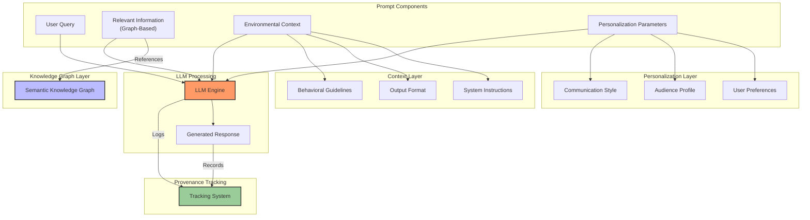

# The Cyber Boardroom: LLM as a Commodity Strategy

## Executive Summary

The Cyber Boardroom's approach to Large Language Models (LLMs) is grounded in Wardley Mapping principles, specifically the natural evolution of components through the Innovate-Leverage-Commoditize (ILC) cycle. Rather than competing in the rapidly commoditizing space of model development, the platform positions itself to leverage LLMs as they evolve from product to commodity, focusing on value creation through novel applications and integrations.

This strategy aligns with Simon Wardley's observation that components naturally evolve from genesis to custom-built to product to commodity. By treating LLMs as evolving commodities, the platform can focus on higher-order value creation while benefiting from the continuing industrialization and standardization of language models.

## Strategic Framework

### Evolution-Based Strategy

The platform's strategy is built on understanding where LLMs sit on the evolution curve:

1. **Genesis to Custom**: Early LLMs required significant custom development
2. **Custom to Product**: Current market shows productization through major providers
3. **Product to Commodity**: Increasing standardization and cost reduction
4. **Commodity Characteristics**: 
   - Standardized interfaces
   - Multiple providers
   - Decreasing costs
   - Increasing reliability

This evolution understanding drives key strategic decisions:
- Focus on integration rather than model development
- Leverage multiple providers as they emerge
- Adapt to standardization trends
- Capitalize on decreasing costs

## Core Strategy Components

### 1. Model Integration Framework

The platform's integration framework is designed around the principle that LLMs are evolving rapidly towards commoditization, as evidenced by:
- Increasing number of providers
- Standardizing APIs
- Decreasing costs per inference
- Improving baseline capabilities

Rather than betting on a single provider or technology, the platform creates value through a flexible abstraction layer that treats LLMs as interchangeable components where appropriate. This approach enables:

- Integration with multiple providers (OpenAI, Anthropic, Google, AWS)
- Support for self-hosted open-source models
- Hybrid deployment capabilities
- Air-gapped installations

The framework anticipates further commoditization by:
- Maintaining provider independence
- Focusing on standardized interfaces
- Leveraging competition between providers
- Planning for continued cost reduction

### 2. Prompt Engineering Architecture

The platform's prompt engineering architecture represents a higher-value layer built on top of commoditizing LLM capabilities. While the underlying models become commodities, the sophistication of prompt engineering remains a key value differentiator.

The relevant information component consists of a graph-based knowledge representation that provides essential context for the query. This structured approach ensures that the model receives comprehensive yet focused information relevant to the specific task.

Environmental context data defines the operational parameters for the model, including system instructions, output format requirements, and behavioral guidelines. This standardization ensures consistent responses across different models and providers.

Personalization parameters capture user preferences, audience characteristics, and communication requirements. This information enables the model to generate responses that align with the user's needs and organizational context.

The user query component contains the actual prompt or question, enhanced by the previous three elements to ensure accurate and relevant responses.

### 3. Value Creation Above Commodity

Following Wardley's principles, the platform focuses on creating value in layers above the commoditizing LLM infrastructure:

1. **Novel Applications**:
   - Business process integration
   - Domain-specific workflows
   - Custom interaction patterns

2. **Unique Capabilities**:
   - Multi-model orchestration
   - Context-aware processing
   - Semantic knowledge integration

3. **Strategic Positioning**:
   - Focus on business value creation
   - Industry-specific solutions
   - Compliance and governance

### 4. Provenance and Trust

As LLMs commoditize, provenance and trust become key differentiators. The platform maintains comprehensive tracking of:

- Model version and provider data
- Hosting environment details
- License compliance information
- Authentication parameters

This creates value through:
- Audit trail maintenance
- Regulatory compliance
- Risk management
- Quality assurance

### 5. Cost Evolution Strategy

The platform's cost strategy aligns with Wardley's evolution patterns:

1. **Current State**: 
   - Multiple providers
   - Varying cost structures
   - Quality differentials

2. **Evolution Tracking**:
   - Cost reduction monitoring
   - Quality standardization
   - Interface consolidation

3. **Adaptation Mechanisms**:
   - Dynamic provider selection
   - Cost-based routing
   - Performance optimization
   - Resource pooling

### 6. Future-Proofing Through Evolution

The platform's future-proofing strategy is based on Wardley's principle that evolution is predictable:

1. **Current Trajectory**:
   - Increasing standardization
   - Decreasing costs
   - Improving baseline quality
   - Growing provider competition

2. **Strategic Response**:
   - Provider-agnostic architecture
   - Value creation above commodity layer
   - Focus on unique applications
   - Adaptation to emerging standards

### 7. Semantic Knowledge Integration

While LLMs commoditize, the platform creates value through sophisticated knowledge integration:

1. **Graph Processing**:
   - Custom optimization
   - Domain-specific modeling
   - Integration patterns

2. **Value Addition**:
   - Contextual enhancement
   - Domain knowledge integration
   - Custom workflows

## Technical Implementation

### 1. Multi-Model Architecture
- Provider integration framework
- Model switching capabilities
- Performance monitoring systems
- Load balancing strategies

### 2. Quality Assurance
- Triple redundancy checks
- Cross-model verification
- Output validation systems
- Consistency monitoring

### 3. Performance Optimization
- Caching strategy
- Resource allocation
- Cost-performance balancing
- Scaling mechanisms

## Strategic Advantages

### 1. Market Position
- Provider independence
- Cost flexibility
- Feature adaptability
- Technology evolution alignment

### 2. Customer Benefits
- Model choice freedom
- Cost transparency
- Performance optimization
- Security compliance options

## Roadmap

### 1. Near-Term Objectives
- Provider integration expansion
- Performance monitoring implementation
- Caching system optimization
- Quality assurance enhancement

### 2. Long-Term Goals
- Advanced model selection intelligence
- Automated optimization systems
- Enhanced semantic processing
- Expanded provider ecosystem

## Risk Management

### 1. Technical Risks
- Provider availability
- Performance variability
- Cost fluctuations
- Integration challenges

### 2. Mitigation Strategies
- Provider redundancy
- Performance monitoring
- Cost optimization
- Integration testing